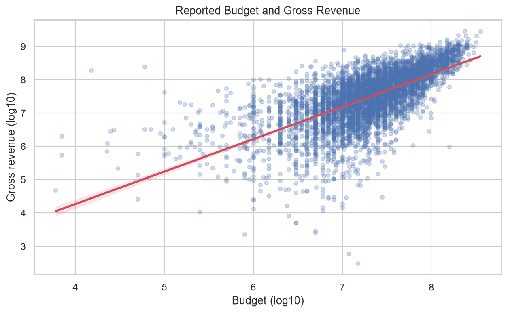
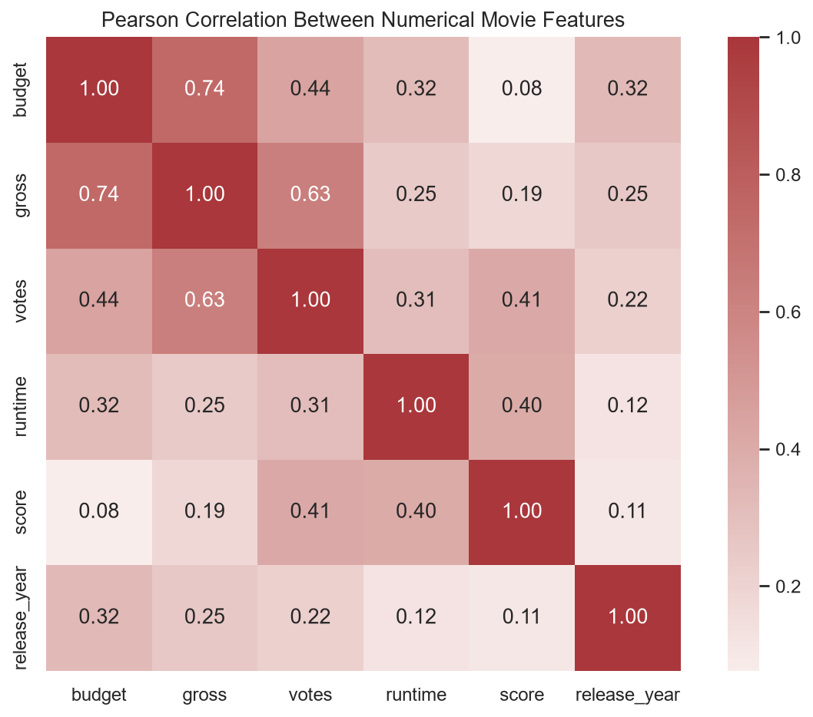

# Movie Revenue & Correlation Analysis

## Overview

An exploratory analysis of movie revenue, production budget, audience engagement, runtime, score, release timing, and genre. The project focuses on defensible missing-value treatment, meaningful numerical correlations, categorical comparison, visualization, and careful interpretation.



## Analytical Questions

1. Which meaningful numerical variables are most strongly associated with gross revenue?
2. How are production budget and gross revenue associated?
3. How are audience votes and scores associated with gross revenue?
4. Do genres show different typical gross revenues?
5. What does gross-to-budget revenue efficiency show when both values are reported?

## Dataset

[`data/movies.csv`](data/movies.csv) contains 7,668 movies and 15 fields covering title, rating, genre, release information, audience score and votes, creative roles, country, company, budget, gross, and runtime. Movies span listed years from 1980 through 2020.

The original repository did not document the dataset publisher, download date, currency, inflation basis, or whether gross is domestic or worldwide. Financial results are therefore described using the dataset's labels rather than stronger provenance claims.

## Data Cleaning

- Checked data types, missingness, exact duplicates, value ranges, and category counts.
- Found no exact duplicate rows or nonpositive budget, gross, or runtime values.
- Parsed release dates after removing trailing parenthetical country text.
- Retained missing values rather than applying blanket mean or mode imputation.
- Excluded missing gross or budget only from analyses requiring those fields.
- Used pairwise complete observations for numerical correlations.

Budget is missing for 2,171 rows (28.3%), while gross is missing for 189 rows (2.5%). Two release dates are missing. Missing descriptive fields such as rating, company, writer, star, and country are retained because they are not required for the selected questions.

## Analysis

Pearson correlation is restricted to budget, gross, votes, runtime, score, and parsed release year. Categorical columns are never converted to arbitrary integer codes. Genre is analyzed through median gross and sample size, with at least 50 reported-gross observations required for the chart.



## Key Findings

- Budget has the strongest positive numerical association with gross revenue (`r ≈ 0.74`).
- Vote count also has a moderately strong positive association with gross (`r ≈ 0.63`).
- Audience score has a much weaker association with gross (`r ≈ 0.19`).
- Animation and action have the highest median gross among genre groups with substantial sample sizes.
- The median reported gross-to-budget multiple is approximately 1.83 among 5,436 movies with both values reported and positive.

These are observational associations. They do not show that raising a budget, receiving votes, or belonging to a genre causes higher revenue.

## Visual Results

The notebook generates five reusable figures:

- Gross-revenue distribution on a logarithmic scale
- Numerical Pearson-correlation heatmap
- Budget-versus-gross relationship
- Audience-votes-versus-gross relationship
- Median gross by genre with sample-size labels

Additional images are available in [`images/`](images/).

## Level-Up: Revenue Efficiency

The notebook calculates `gross / budget` only where both values are reported and positive. This is a gross-return multiple, not profit or ROI, because marketing, distribution, exhibitor shares, financing, and other costs are unavailable.

## Tech Stack

- Python
- pandas and NumPy
- Matplotlib and seaborn
- Jupyter Notebook

## Repository Structure

```text
data/
  movies.csv
images/
  generated analysis charts
notebooks/
  movie_revenue_eda.ipynb
requirements.txt
README.md
.gitignore
```

## How to Run

```powershell
python -m venv .venv
.venv\Scripts\python -m pip install -r requirements.txt
.venv\Scripts\jupyter notebook notebooks/movie_revenue_eda.ipynb
```

Run every notebook cell from top to bottom. Relative-path discovery supports launching Jupyter from either the repository root or the `notebooks` directory.

## Limitations

- Dataset provenance and financial definitions are undocumented.
- Missing budgets may make complete-budget analyses unrepresentative.
- Financial values are nominal and not adjusted for inflation or market.
- A single genre label may hide multi-genre characteristics.
- Pearson correlation captures linear association and is sensitive to skew and outliers.
- Votes, distribution reach, budget, franchises, and release timing are interrelated.
- Revenue efficiency omits important costs and is not profitability or ROI.
